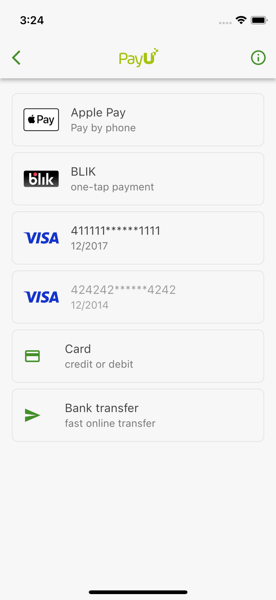
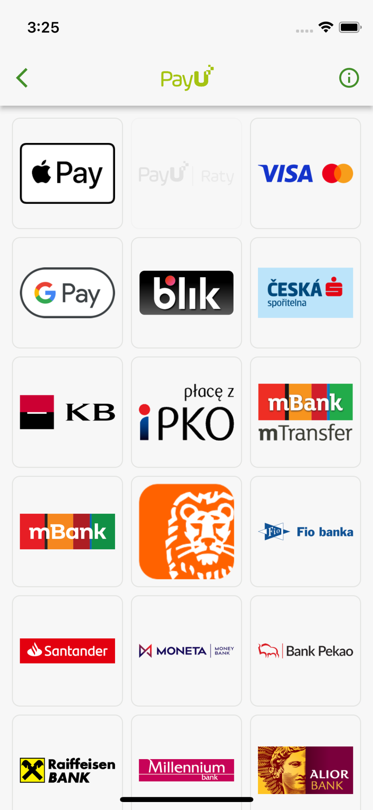
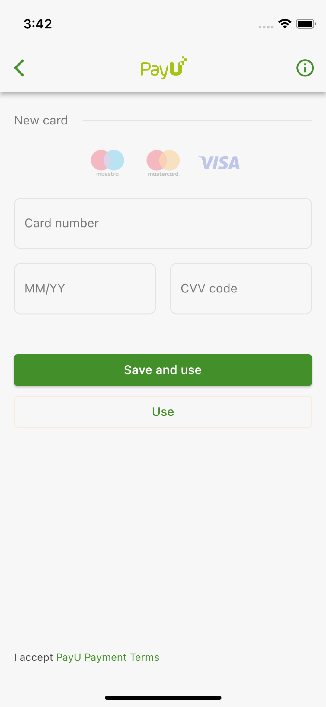
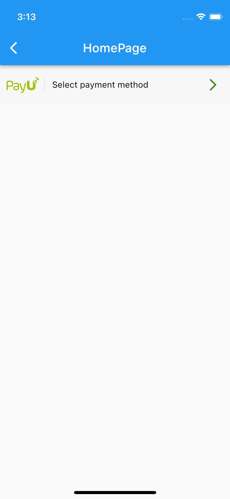
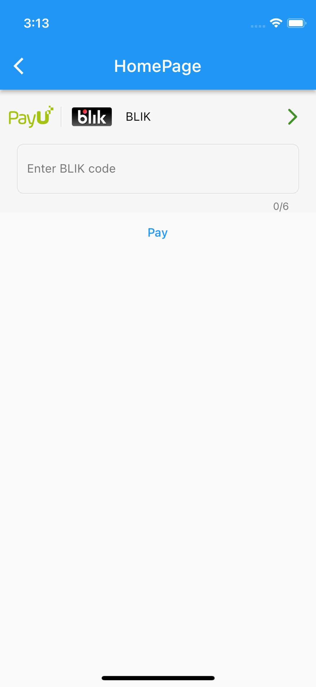

## Features

Flutter package which allows to present available POS payment methods easy

* [Core](#core)
* [Example](#example)
* [Payment methods](#payment-methods)

## Getting started

Payment methods must be retreived from your backend, because request requires authorization, which is `strongly` recommended to be done by the backend. Your app can only receive payment methods, present it and process the selected one. Also, each payment method which is used in `payu_payment_methods` package has default method `toJSON()` which can be very helpfull during the API integration, for ex. if you are using `Retrofit`.

<a id="core"></a> 

## Core

* [PaymentMethodsConfiguration](#core-payment-methods-configuration)
* [PaymentMethodsPage](#core-payment-methods-page)
* [PaymentMethodsWidget](#core-payment-methods-widget)
* [PaymentMethodsProcessor](#core-payment-methods-processor)
* [PaymentMethodsStorage](#core-payment-methods-storage)

<a id="core-payment-methods-configuration"></a> 

### PaymentMethodsConfiguration

Configuration class is the class, which contains all necessary payment methods details, for ex: `blikTokens`, `cardTokens`, `payByLinks`. Also there are some options which allows merchants to customise the items to present. 

<a id="core-payment-methods-page"></a> 

### PaymentMethodsPage

This page is responsible for displaying and selecting of payment methods. It has own sorting option which is not customizable. 

<a id="core-payment-methods-widget"></a> 

### PaymentMethodsWidget

Class which allows to display available payment methods in a small widget. The implementation handles all available payment methods, for ex: `ApplePay`, `BlikCode`, `BlikToken` etc. Also, widget has `dynamic` height, because it displays `TextField` for giving user ability to type `BLIK` code.

<a id="core-payment-methods-processor"></a> 

### PaymentMethodsProcessor

Processor will help merchants to understand what exact payment method was selected by the user as a result of presenting `PaymentMethodsPage`, casting it from abstract `PaymentMethod` to exact class, for ex: `ApplePay` or `BlikCode`. See [Example](#example) for implementation details.

<a id="core-payment-methods-storage"></a> 

### PaymentMethodsStorage

Storage where merchants will keep information about last selected payment method for user. Last selected payment method will always be on the top of the payment methods list. The data is not sensitive, so it can be stored in, for ex. `preferences`. See [Example](#example) for implementation details.

> It is good idea to have an association between last selected payment method and user

<a id="example"></a> 

## Example

#### 1. Create class which implements `PaymentMethodsStorage`

```dart
class SecureStorage implements PaymentMethodsStorage {
  final SecureDb _secureDb;
  final UserDb _userDb;

  const SecureStorage(this._secureDb, this._userDb);

  @override
  Future<String?> getSelectedPaymentMethodHash() {
    return _secureDb.getSelectedPaymentMethodHashForUser(_userDb.id);
  }

  @override
  Future<void> saveSelectedPaymentMethodHash(String hash) async {
    await _userDb.saveSelectedPaymentMethodHashForUser(hash, _userDb.id);
  }
}
```

#### 2. Get the list of `blikTokens`, `cardTokens` and `payByLinks` from your backend.

 For details of how your backend retreives payment methods read [Payment methods retrieve](https://developers.payu.com/en/restapi.html#Transparent_retrieve). 

```dart
final availablePaymentMethods = await _api.getAvailablePaymentMethods();
```

#### 3. Create `PaymentMethodsConfiguration` instance. 

```dart
final configuration =  PaymentMethodsConfiguration(
  blikTokens: availablePaymentMethods.blikTokens,
  cardTokens: availablePaymentMethods.cardTokens,
  payByLinks: availablePaymentMethods.payByLinks,
);
```

#### 4 (a). Show the `PaymentMethodsPage`. 

The `result` of the navigation to the page is the selected payment method. If `result` is `null` - user did not select anything.

```dart
@override
Widget build(BuildContext context) {
  return AwesomePage(
    body: Center(
      child: TextButton(
        onPressed: () => _didTapGoToPayments(context),
        child: const Text('Go to payment methods'),
      ),
    ),
  );
}

void _didTapGoToPayments(BuildContext context) async {
  final method = await Navigator.of(context).push<PaymentMethod>(
    MaterialPageRoute(
      builder: (context) => PaymentMethodsPage(
        configuration: configuration,
        storage: storage,
      ),
    ),
  );
  
  if (method != null) _processPaymentMethod(method);
}
```

|  |  |  |
| ----------- | ----------- | ----------- |
||||

#### 4 (b). Show the `PaymentMethodsWidget`. 

```dart
@override
Widget build(BuildContext context) {
    return AwesomePage(
      body: Column(
        children: [
          PaymentMethodsWidget(
            configuration: configuration,
            service: service,
            storage: storage,
            onSelect: (method) => _savePaymentMethod(method),
          ),
          TextButton(
            onPressed: () => _processPaymentMethod(method),
            child: const Text('Pay'),
          ),
        ],
      ),
    );
  }
}
```

|  |  |  |
| ----------- | ----------- | ----------- |
||||

#### 5. Call the `PaymentMethodsProcessor` `process` method. 

```dart
void _processPaymentMethod(PaymentMethod method) {
  PaymentMethodsProcessor().process(
    method: method,
    onApplePay: (value) => _didSelectApplePay(value),
    onBlikCode: (value) => _didSelectBlikCode(value),
    onBlikToken: (value) => _didSelectBlikToken(value),
    onCardToken: (value) => _didSelectCardToken(value),
    onInstallments: (value) => _didSelectInstallments(value),
    onPayByLink: (value) => _didSelectPayByLink(value),
  );
}
```

<a id="payment-methods"></a> 

## Payment methods

* [ApplePay](#payment-methods-apple-pay)
* [BlikCode](#payment-methods-blik-code)
* [BlikToken](#payment-methods-blik-token)
* [CardToken](#payment-methods-card-token)
* [Mastercard Installments](#payment-methods-installments)
* [PayByLink](#payment-methods-pay-by-link)

<a id="payment-methods-apple-pay"></a> 

### ApplePay

Once user select `ApplePay` payment method, you need to initiate the payment process using `PayuApplePayService`. As the result of `authorize` method you'll receive `authorizationCode`. For more details visit [payu_mobile_payments](../payu_mobile_payments/payu_mobile_payments_ios)

```dart
void _didSelectApplePay(ApplePay applePay) {
  PayuApplePayService().authorize(
    request: ApplePayPaymentRequest(...),
    onDidAuthorize: (authorizationCode) => debugPrint('onDidAuthorize: $authorizationCode'),
    onDidCancel: () => debugPrint('onDidCancel'),
  );
}
```

`payMethod` for OrderCreateRequest: 
```json 
"payMethod": {
  "type": "PBL",
  "value": "jp", 
  "authorizationCode": "authorizationCode"
}
```

<a id="payment-methods-blik-code"></a> 

### BlikCode

Transparent payment with a T6 code. Once user select `BlikCode` payment method, you need to give user ability to input six-digit code, for ex. via the `AlertDialog` or adding new field to the existing page. Please rememeber to add validation rules to it. For more details visit [developers.payu.com](https://developers.payu.com/en/blik_oneclick.html)

```dart
void _didSelectBlikCode(BlikCode blikCode) await {
  final sixDigitCode = await showDialog<String>(
    context: context,
    builder: (context) => BlikCodeAlertDialog(),
  );
  debugPrint('sixDigitCode: $sixDigitCode');
}

class BlikCodeAlertDialog extends StatelessWidget {
  final _textEditingController = TextEditingController();

  BlikCodeAlertDialog({Key? key}) : super(key: key);

  @override
  Widget build(BuildContext context) {
    return AlertDialog(
      title: const Text('Enter 6 digits BLIK'),
      content: TextField(
        controller: _textEditingController,
      ),
      actions: [
        TextButton(
          onPressed: () => Navigator.of(context).pop(),
          child: const Text('Cancel'),
        ),
        TextButton(
          onPressed: () => Navigator.of(context).pop(_textEditingController.text),
          child: const Text('Use'),
        ),
      ],
    );
  }
}
```

`payMethod` for OrderCreateRequest: 
```json 
"payMethod": {
  "type": "BLIK_TOKEN",
  "authorizationCode": "blikCode"
}
```

<a id="payment-methods-blik-token"></a> 

### BlikToken

Transparent payment with a token. If customers saved a token durign their last BLIK payment, they can now pay with OneClick without entering a new code.

```dart
void _didSelectBlikToken(BlikToken blikToken) {
  debugPrint('blikToken: $blikToken');
}
```

`payMethod` for OrderCreateRequest: 
```json 
"payMethod": {
  "type": "BLIK_TOKEN",
  "value": "blikToken.value"
}
```

<a id="payment-methods-card-token"></a> 

### CardToken

```dart
void _didSelectCardToken(CardToken cardToken) {
  debugPrint('cardToken: $cardToken');
}
```

`payMethod` for OrderCreateRequest: 
```json 
"payMethod": {
  "type": "CARD_TOKEN",
  "value": "cardToken.value"
}
```

<a id="payment-methods-installments"></a> 

### Mastercard Installments

```dart
void _didSelectPayByLink(Installments installments) {
  debugPrint('installments: $installments');
}
```

`payMethod` for OrderCreateRequest: 
```json 
"payMethod": {
  "type": "PBL",
  "value": "installments.value"
}
```

### PayByLink (PBL)

```dart
void _didSelectPayByLink(PayByLink payByLink) {
  debugPrint('payByLink: $payByLink');
}
```

`payMethod` for OrderCreateRequest: 
```json 
"payMethod": {
  "type": "PBL",
  "value": "payByLink.value"
}
```

## Additional information

TODO: Tell users more about the package: where to find more information, how to 
contribute to the package, how to file issues, what response they can expect 
from the package authors, and more.